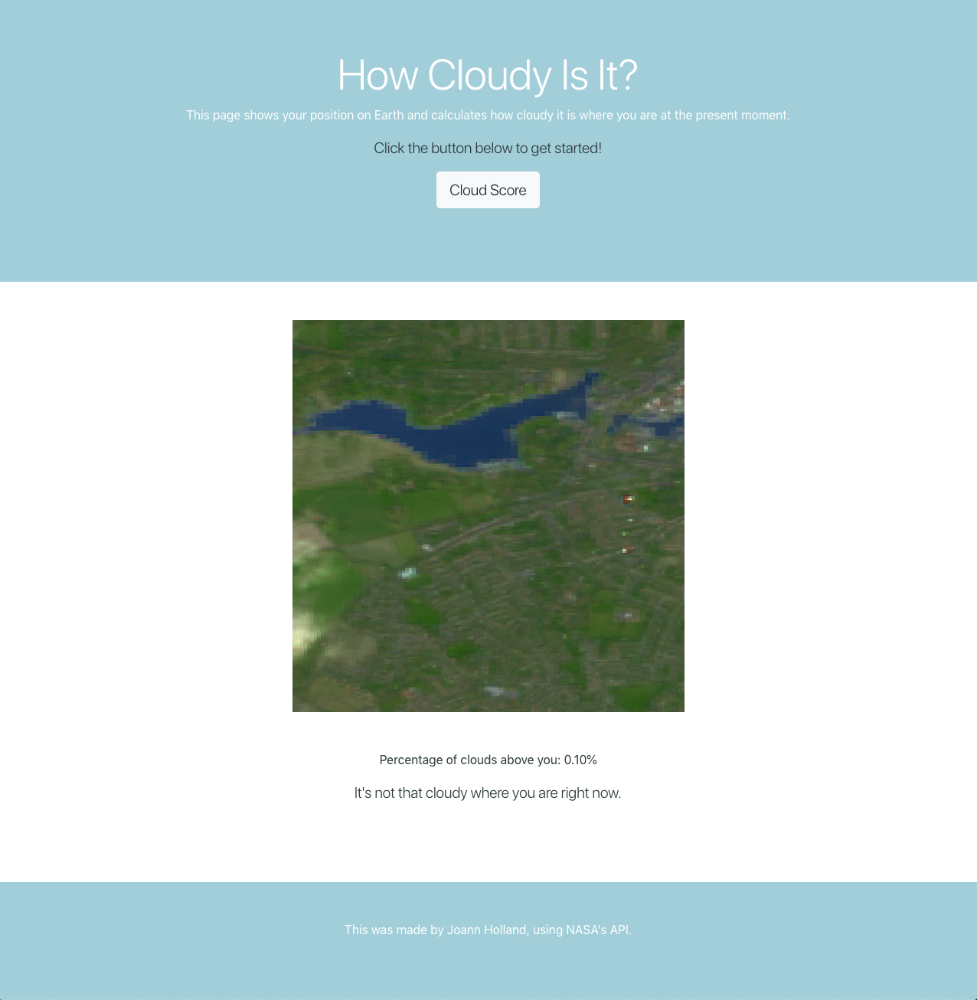

# How Cloudy Is It?

Makes use of the NASA API to get a satellite image of cloud score based on your current location.

 

The main purpose behind this was to experiment with using API's in tandem with AJAX and jQuery.
